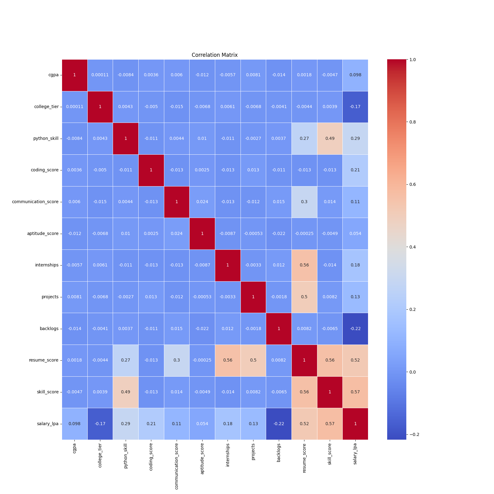
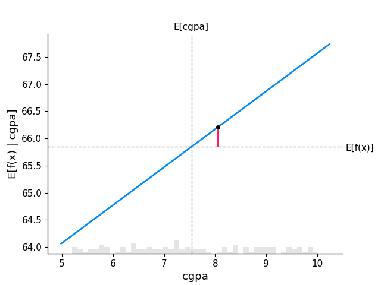
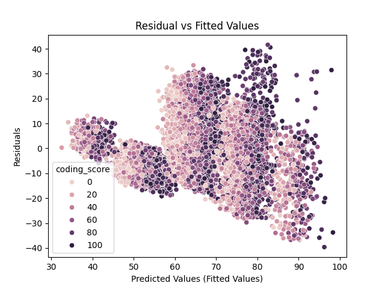
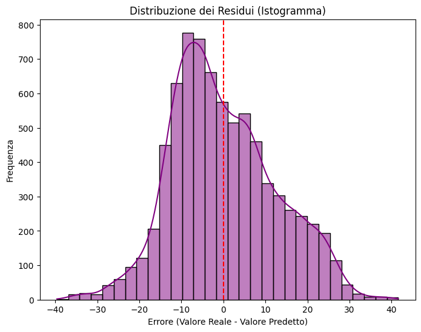
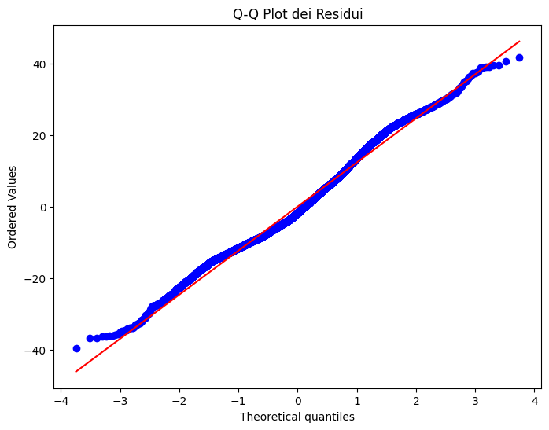
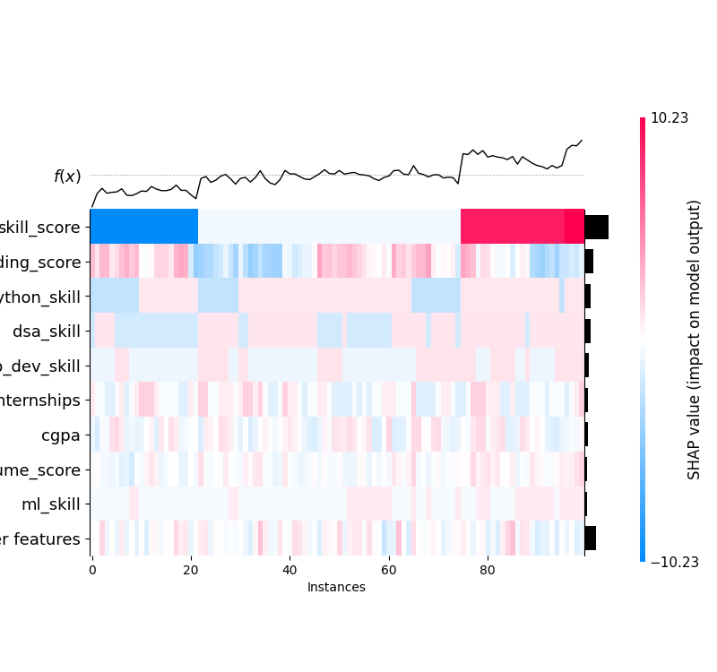
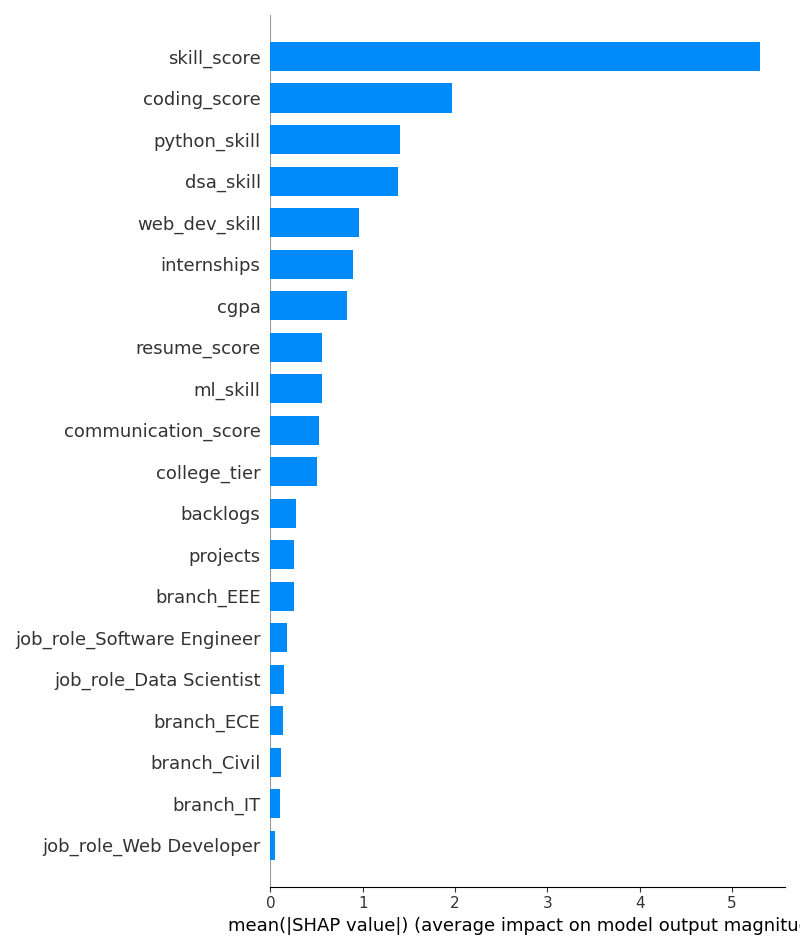

# Relazione Analisi Predittiva: LR_Salary

## 1. Metriche di Confidenza del Modello
Modello di Regressione Lineare addestrato sul subset degli studenti inseriti.

| Metrica | Valore |
| :--- | :--- |
| R-squared | 0.4696 |
| Mean Absolute Error (MAE) | 10.0594 |
| Root Mean Squared Error (RMSE) | 153.8994 |

## 2. Analisi dei Coefficienti
Valori dei coefficienti del modello, suddivisi per una consultazione rapida (Bland's rule: massima leggibilità).

### Blocco 1 (Feature 1 - 10)
| Feature             |   Coefficiente |
|:--------------------|---------------:|
| cgpa                |     0.698475   |
| college_tier        |    -0.767626   |
| python_skill        |     3.41772    |
| dsa_skill           |     2.96119    |
| ml_skill            |     1.28006    |
| web_dev_skill       |     1.99186    |
| coding_score        |     0.0826788  |
| communication_score |     0.331428   |
| aptitude_score      |     0.00259148 |
| internships         |     1.05043    |

---

### Blocco 2 (Feature 11 - 20)
| Feature                 |   Coefficiente |
|:------------------------|---------------:|
| projects                |     -0.158641  |
| backlogs                |      0.476632  |
| resume_score            |      0.0439422 |
| skill_score             |      9.65083   |
| branch_Civil            |      0.394932  |
| branch_ECE              |      0.534734  |
| branch_EEE              |      0.612492  |
| branch_IT               |      0.375147  |
| branch_Mechanical       |     -0.23886   |
| job_role_Data Scientist |      0.399677  |

---

### Blocco 3 (Feature 21 - 22)
| Feature                    |   Coefficiente |
|:---------------------------|---------------:|
| job_role_Software Engineer |       0.466588 |
| job_role_Web Developer     |       0.110749 |

---

## 3. Analisi Visuale e Diagnostica
Di seguito i grafici diagnostici esportati in automatico durante la run del modello.

### Correlation Matrix

### Partial Dependence Cgpa Sample 20

### Residual Plot

### Residui Istogramma

### Residui Qq Plot

### Shap Heatmap

### Shap Summary

