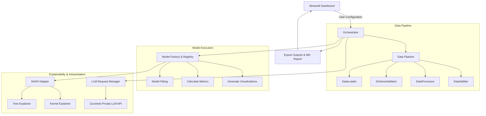

# 


An Explainable AI (XAI) analysis pipeline developed as a Bachelor's thesis project in collaboration with Zucchetti S.p.A.

This project bridges the gap between complex machine learning models and human understanding. It combines traditional interpretability techniques (such as SHAP values and model coefficients) with state-of-the-art Large Language Models (LLMs) to automatically generate human-readable, domain-specific explanations of algorithmic decisions for non-technical stakeholders.

---

## Architecture Overview

The system is designed following strict object-oriented programming guidelines (SOLID principles) and standard GoF design patterns to ensure modularity, high cohesion, and scalability.



### Applied Design Patterns

*   **Strategy Pattern:** Decouples the orchestrator from concrete model training and SHAP analysis. Algorithms and explainers implement common interfaces, allowing the execution flow to dynamically switch strategies at runtime.
*   **Template Method Pattern:** Defines the skeleton of the data pipeline (`BasePipeline`) and the orchestrator workflow, delegating concrete execution steps to specific components while maintaining structural integrity.
*   **Factory Pattern:** Implemented via `ModelFactory` to handle the instantiation of regressors and classifiers without exposing creation logic to the client code.
*   **Registry Pattern:** Dynamically manages registered algorithms and their configurations, making it trivial to extend the framework with new models.
*   **Adapter Pattern:** Standardizes model-specific estimators and wraps them into a uniform `SHAPAnalyzerAdapter` interface to ensure compatibility with SHAP tree and kernel explainers.
*   **Facade Pattern:** Exposes a simple `run_pipeline` interface through the Orchestrator to hide the underlying complexity of data handling, fitting, plotting, and LLM communication from the Streamlit UI.

---

## Key Features

*   **Multi-Model Support:** Native support for both regression and classification tasks, containing:
    *   *Regression:* OLS Linear Regression, Decision Trees, Random Forests, XGBoost, and Symbolic Regression (via PySR).
    *   *Classification:* Logistic Regression, Support Vector Machines (SVM), Decision Trees, Random Forests, and XGBoost.
*   **Flexible Data Processing:** A robust ETL pipeline handling CSV loading, schema validation, missing data strategies, categorical feature encoding, and stratified dataset splitting.
*   **Explainable AI (XAI) Diagnostics:**
    *   *Intrinsic Parameters:* Extraction of regression coefficients, tree decision paths, and ensemble feature importances.
    *   *Post-hoc Interpretability:* Dynamic execution of SHAP (SHapley Additive exPlanations) using optimized Tree and Kernel explainers, generating dependency plots, force plots, and summary bars.
*   **Automated LLM Reports:** Converts performance metrics, coefficients, and generated plots (encoded as Base64 images) into a comprehensive Markdown analysis report (`LLM_Analysis_Report.md`) using private multimodal LLMs.
*   **Prompt Engineering Principles:** Prompts are structured based on systematic XAI rules to enforce brevity, clarify correlation vs. causality, map explanations to domain language, and highlight data anomalies.
*   **Interactive Dashboard:** Streamlit-powered user interface to configure, monitor, and compare single-model or multi-model runs.

---

## Technologies Used

### Core Language & UI
*    **Python** (>= 3.12) - Main programming language.
*    **Streamlit** (>= 1.58.0) - Interactive dashboard interface.

### Machine Learning & Explainable AI
*    **Scikit-Learn** (>= 1.9.0) - Machine learning models and preprocessing estimators.
*    **XGBoost** (>= 3.3.0) - Optimized gradient boosting framework.
*    **PySR** (>= 1.5.10) - Symbolic regression utilizing Julia backend.
*    **SHAP** (>= 0.52.0) - Cooperative game theory based model explanation framework.

### LLM & API Integration
*    **OpenAI SDK** (>= 2.43.0) - Client used to query private multimodal LLMs via Zucchetti's API gateway.

### Data Manipulation & Visualizations
*    **Pandas** (>= 3.0.3) - Data analysis and manipulation tables.
*    **NumPy** (>= 2.4.6) - Numerical computing arrays.

### Testing
*    **Pytest** (>= 9.1.1) - Unit testing framework.

---

## Operational Flow

```
[Dataset selection] ➔ [Data Pipeline Preprocessing] ➔ [Model Fitting & GridSearch] ➔ [Plot & SHAP Generation] ➔ [Base64 Image Encoding] ➔ [LLM Evaluation] ➔ [Markdown Report Output]
```

1.  **Configuration:** The user selects a dataset (e.g., *Student Salary*, *Heart Disease*, *Life Expectancy*) and chooses to execute a single model or a comparative analysis.
2.  **Preprocessing:** The data pipeline processes features, removes identifiers, handles missing values, and splits the data.
3.  **Training & Metrics:** The selected models are trained, hyperparameters are tuned, and standard metrics (MSE, R², Precision, Recall, F1, AUC-ROC) are calculated.
4.  **Explainability:** Diagnostic graphs and SHAP values are generated. Plots are saved locally to `src/output/<Model>_<Task>_<Dataset>`.
5.  **Data Translation:** Metrics and plots are packed and sent to the Zucchetti LLM gateway. The gateway queries LLMs (like Gemma or Qwen) with custom role prompts to produce the final `LLM_Analysis_Report.md`.
6.  **Visualization:** The results and Markdown reports are displayed directly on the Streamlit dashboard console.

---

## Setup and Installation

### Prerequisites

*   Python 3.12 or higher
*   `uv` package manager (recommended) or `pip`

### Step 1: Install Dependencies

Using `uv` (recommended for faster dependency resolution):
```bash
uv sync
```
Or using standard `pip`:
```bash
pip install -r requirements.txt
```

### Step 2: Configure Environment Variables

Create a `.env` file in the root directory and define the credentials for the private LLM API:
```env
OPENAI_API_KEY=your_llm_api_key
BASE_URL=https://your.llm.gateway.it/
```

### Step 3: Run the Dashboard

Launch the Streamlit web interface:
```bash
streamlit run src/core/app.py
```

### Step 4: Run Tests

Execute the unit test suite to verify the pipeline logic:
```bash
pytest
```
To run tests with code coverage analysis:
```bash
pytest --cov=src
```

## More DOCS

Additional documentation is available in the [Bachelor Degree Thesis](https://github.com/Solgio/Explainable-Machine-Learning-Bachelor-Thesis-)
